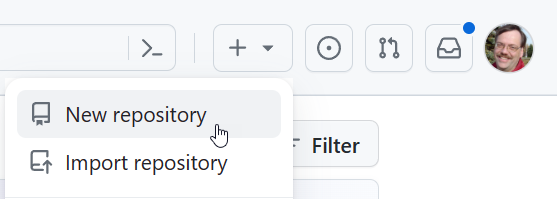

# Version Control (for DBAs)

---

## Learning Outcomes (pg 1 of 3)

*At the end of this topic, you should be able to:*

- Define the acronym **DVCS**
- List the benefits of using a version control system for this course
- Create a new repository through the browser on GitHub.com
- Use the command line to manage a git repository
- Define the terms **clone**, **commit**, **stage**, **pull**, and **push**

---

## Learning Outcomes (pg 2 of 3)

- Describe the purpose of a `.gitignore` file
- Describe the purpose of a `.gitattributes` file
- Distinguish between a remote repository and a local repository
- Synchronize a local repository with a remote repository

---

## Learning Outcomes (pg 3 of 3)

- Describe the purpose of a `ReadMe.md` file
- Define the term **Markdown**
- List three benefits of using Markdown documents as opposed to tools such as Microsoft Word or languages like HTML

---

### 1. Define DVCS

* **DVCS** stands for Distributed Version Control System.
* Allows multiple users to work on a project without interfering with each other.
* Each user has a complete copy of the repository.

---

### 2. Benefits of Version Control

* Track and revert changes.
* Collaborate with multiple team members.
* Maintain a history of project versions.
* Essential for team-based projects and continuous integration.

---

### 3. Command Line Management

* Navigate using terminal or command prompt.
* Use commands like `git init`, `git add`, and `git commit`.
* Essential for advanced git operations.

---

### 4. Key Terms

* **Clone**: Copy a repository to your local machine.
* **Commit**: Save changes with a message.
* **Stage**: Prepare changes for a commit.
* **Pull**: Fetch changes from a remote repository.
* **Push**: Send changes to a remote repository.

---

### 5. `ReadMe.md` File

* Provides an overview and instructions for the project.
* Typically the first file users see in a repository.
* Can include project setup, usage, and contribution guidelines.

---

### 6. `.gitignore` File

* Lists files and directories to be ignored by git.
* Useful for excluding sensitive data or build artifacts.
* Each line in the file specifies a pattern.

---

### 7. `.gitattributes` File

* Defines attributes for paths.
* Can be used to specify line endings, diff settings, and more.
* Helps ensure consistent settings across environments.

---

### 8. Remote vs. Local Repository

* **Remote**: Hosted on a server (e.g., GitHub, GitLab).
* **Local**: Resides on your personal computer.
* Changes are made locally and then pushed to the remote.

---

### 9. Create a Repository

* Navigate to your personal profile on GitHub.com.
* Click on "New Repository".
* Fill in repository details and initialize.
  * Name it "Playground"
  * Add a README file
  * Do not add `.gitignore` (yet)
* Clone to your local computer
  * *Now* add a `.gitignore`
  * Add a [`.gitattributes`](https://gist.github.com/dagilleland/b63c5fc2865941a863cc759682e9599d) file

---

### 10. Synchronization

* Use `git pull` to fetch and merge changes.
* Use `git push` to send local changes to the remote.
* Ensures both repositories are up-to-date.

---

### 11. Define Markdown

* Lightweight markup language.
* Used for formatting text.
* Commonly used for READMEs, documentation, and more.
  * Can even be extended for things like slideshows (this document)

---

### 12. Benefits of Markdown

* Allows you to focus on the content rather than the formatting (because it is purely text-based).
* Version-control-friendly (as opposed to Word documents, which can easily cause merge conflicts).
* Platform-independent; can be viewed on any device.
* Simple syntax, easy to learn.

---

## Conclusion

* Recap of the main points covered.
* Encourage practice and application of the concepts learned.

