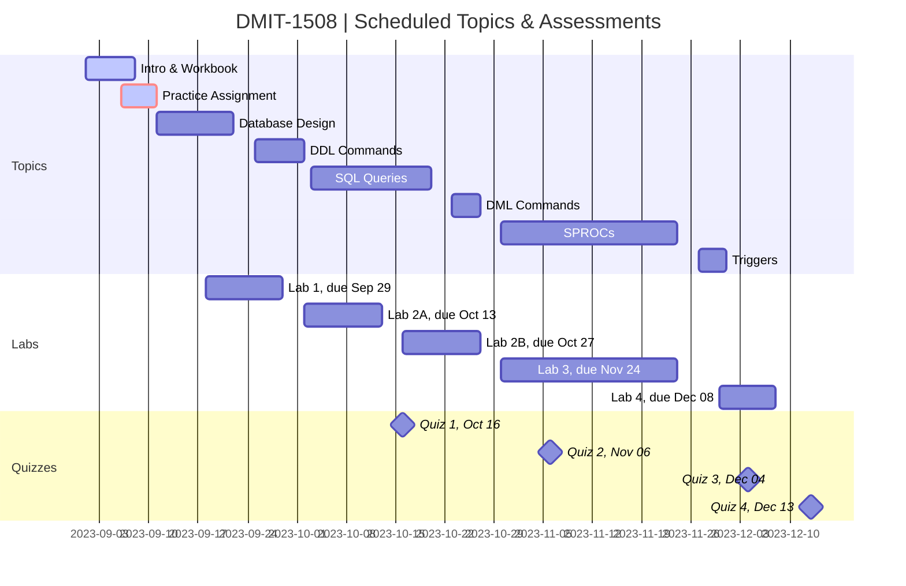

# DMIT-1508 - **Instructor Workbook** (Sep 2023)

> **Dan Gilleland** - Place your name in this line.

## Schedule
 
> The following schedule is subject to change. Consult the course outline for the mark distribution. See the [Agenda](./Agenda.md) for details on upcoming and completed topics.

## Inside this repository

This repository is your **Student Workbook** (:notebook:) for participating in the in-class demos and for completing practice homework.

> :warning: **Do *NOT*** use this repository for any assignments that are worth marks. For submitting any work that is worth marks in this course, only use repositories set up/approved by your instructor. :warning:

The files in this repository branch are my in-class examples. There are some (old) unofficial [website notes](https://dmit-1508.github.io). Additionally, you can find online notes at the [MS Teams Site](https://www.microsoft.com/en-ca/microsoft-teams/log-in) for the course. Also be sure to checkout out the [**Learning Outcomes**](./Docs/logs/ReadMe.md) that I use in class.

## Outline

The general topics in this workbook include

- [**Normalization**](Design/)
- SQL statements for 
  - [**DDL**](DDL/) (Data Definition Language) - `CREATE TABLE` etc.
  - [**DML**](DML/) (Data Manipulation Language) - `INSERT INTO` etc.
  - [**Queries**](SQL/) - `SELECT` etc.
  - [**Stored Procedures**](SPROCS/) (sprocs) - `CREATE PROCEDURE` etc.
  - [**Triggers**](Triggers/) - `CREATE TRIGGER` etc.

----

## Software and Resources

Recommended tools for this course include:

- [SQL Server 2019](https://www.microsoft.com/en-us/sql-server/sql-server-downloads) or higher, **Developer Edition**
  - If you are installing SQL Server on a Mac, follow the instructions in this article:
    - [How to Install SQL Server on a Mac](https://database.guide/how-to-install-sql-server-on-a-mac/)
  - You might also find this video useful:
    - [Step By Step Guide To Install MSSQL Server On Mac Using Docker](https://youtu.be/BVNWRYPv78o) (20 min, 27 sec)
- [Git for Windows/macOS/Linux](https://git-scm.com/downloads)
- [GitHub CLI](https://cli.github.com/)
- [**Visual Studio Code**](https://code.visualstudio.com) as your *primary editor*
  - Begin your journey with VS Code with these [introductory videos](https://code.visualstudio.com/docs/introvideos/overview).
  - Alternate SQL Editors:
    - [Sql Server Management Studio](https://docs.microsoft.com/en-us/sql/ssms/download-sql-server-management-studio-ssms?view=sql-server-ver15#download-ssms) (*SSMS*)
    - [Azure Data Studio](https://docs.microsoft.com/en-us/sql/azure-data-studio/download-azure-data-studio)
- [**LucidChart**](https://www.lucidchart.com/pages/) or **Draw.io** ([VS Code Extension](https://marketplace.visualstudio.com/items?itemName=hediet.vscode-drawio) vs. [desktop](https://about.draw.io/integrations/#integrations_offline) vs. [online](https://draw.io) versions)

> A [Winstall package](https://winstall.app/packs/6UXIuqRuh) is available for this course.

Other recommended resources include:

- [Learn Markdown](https://commonmark.org/help/)
